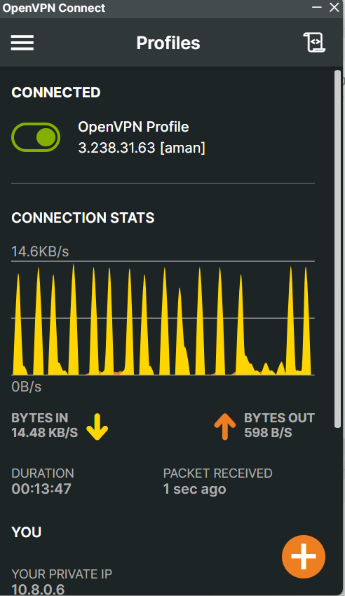
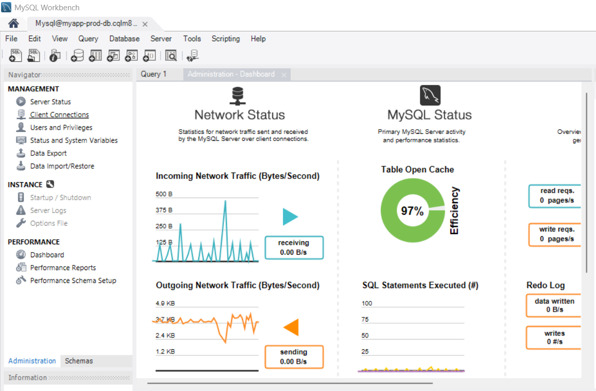

# openvpn-server

OpenVPN Server is a powerful and flexible VPN solution that allows secure remote access to private networks. In this project, I have utilized OpenVPN to set up a secure VPN server on an EC2 instance. This setup enables me to connect my Windows machine to the VPN and access private resources, such as RDS instances, directly and securely.

## 📊 Repository Overview

- **Owner:** [@AmanKumar-Gupta](https://github.com/AmanKumar-Gupta)
- **Primary Language:** HCL
- **Default Branch:** `main`

### 📈 Language Distribution

- **HCL:** 73.8%
- **Shell:** 26.2%

### 📁 Project Structure

```
📄 .gitignore
📄 README.md
📁 Screenshots/
  📄 Terraform outputs.png
  📄 openvpn-connection.png
  📄 private-rds-connection.png
📁 Test-Infra-IAC/
  📁 Modules/
    📁 rds/
      📄 main.tf
      📄 outputs.tf
      📄 variables.tf
    📁 vpc/
      📄 main.tf
      📄 outputs.tf
      📄 variables.tf
  📁 Root/
    📄 main.tf
    📄 outputs.tf
    📄 variables.tf
📄 aman.ovpn
📄 generate-client.sh
📄 vpn-setup.sh
```

## 🚀 Getting Started

1. Clone the repository
   ```bash
   git clone https://github.com/AmanKumar-Gupta/openvpn-server.git
   ```

2. Navigate to the project directory
   ```bash
   cd openvpn-server
   ```

3. Follow the configuration steps to set up the OpenVPN server and connect your client.

## 🔧 Configuration

The OpenVPN server is installed on an EC2 instance. After setting up the server, you need to install openvpn client on your machine then generate .ovpn file on ec2 instance and copy it to your local machine then you can use that file to connect your openvpn server. Once connected, you can securely access private resources, such as RDS instances, within the VPC.

### Screenshots

Below are some screenshots demonstrating the setup and functionality:

1. **Terraform Outputs**  
   

2. **OpenVPN Connection**  
   

3. **Private RDS Connection**  
   

## 🤝 Contributing

Contributions are welcome! Here's how you can help:

1. Fork the repository
2. Create a feature branch (`git checkout -b feature/amazing-feature`)
3. Commit your changes (`git commit -m 'Add amazing feature'`)
4. Push to the branch (`git push origin feature/amazing-feature`)
5. Open a Pull Request

## 📝 License

This project is licensed under the MIT License - see the [LICENSE](LICENSE) file for details.
